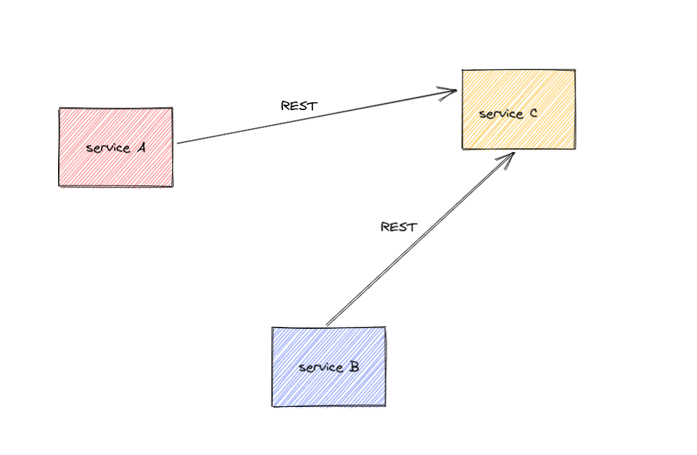
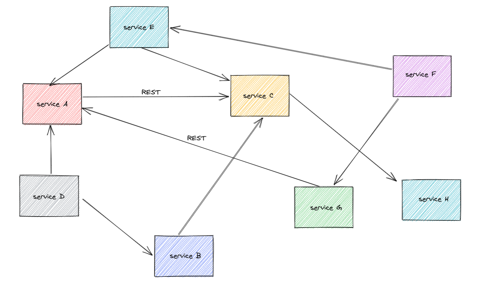
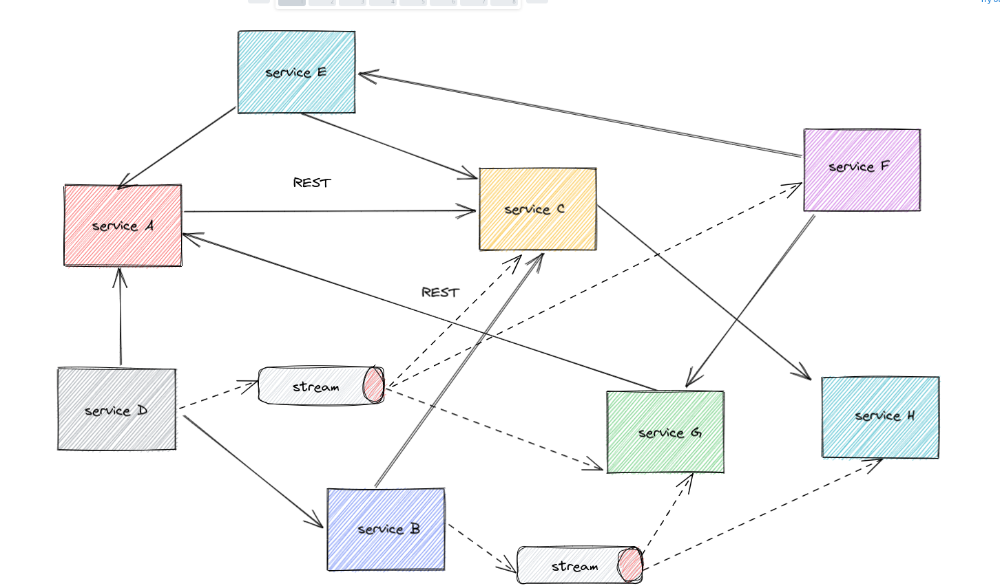
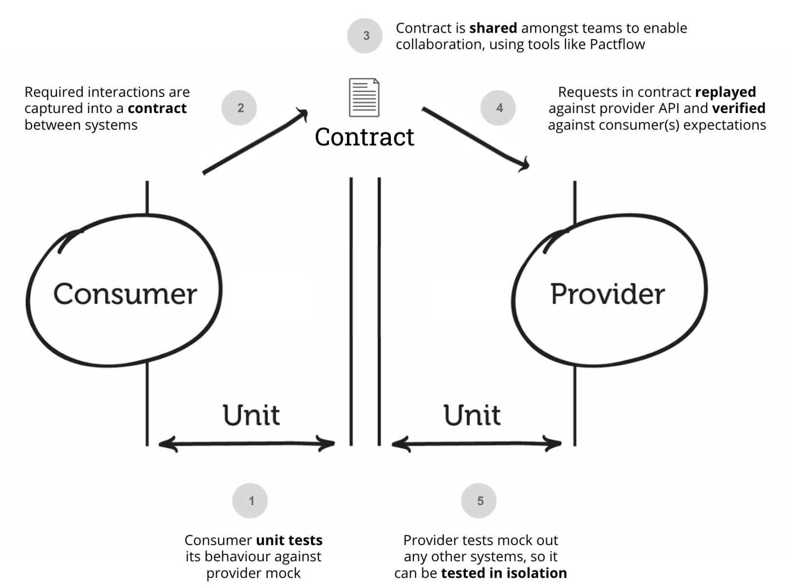
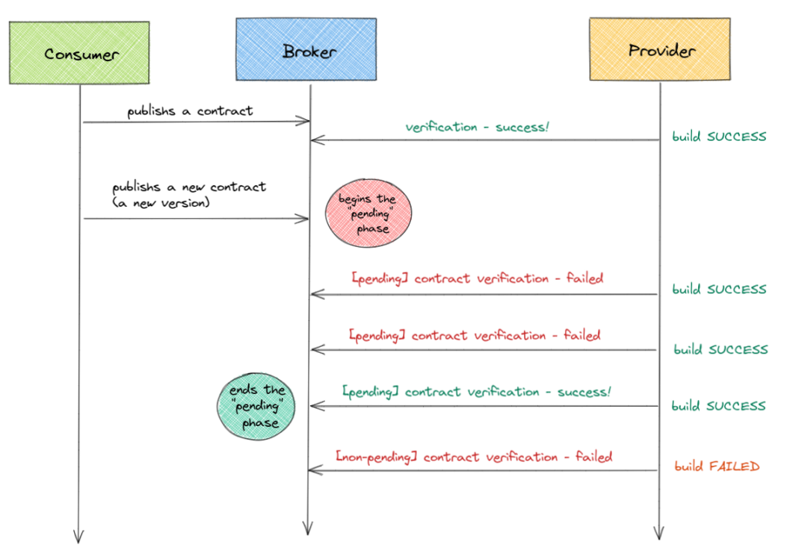

# Consumer-Driven Contracts

### with Pact

Note: 
* who knows?
* who uses?
* who knows pact?

---

## The problem



Note:
* few services
* one team or maybe two?

---

## The problem



Note:
* many services, many APIs
* many teams, different release cycles (CI/CD)
* a lot of communication between teams (TALKS!)


---

## The problem




---


## CDC to the rescue



[source](https://docs.pact.io/)

Note:
* why - many services, many APIs
* why - many teams, different release cycles (CI/CD)
* consumer creates the contract
* consumer tests the contract
* providers tests the contract as well
* both sides test the contract

---

## Consumer-Driven Contracts
### What we will get

* Isolation
* Simplified End-to-End Tests (lack of e2e?)
* Feedback Time
* Stability
* Well-Fittedness
* Reveal Unused Interfaces

[source](https://reflectoring.io/7-reasons-for-consumer-driven-contracts/)

---

## Consumer-Driven Contracts
### When it does not fit

* public APIs for unknown consumers
* we have very few services (one, two...) 

Note:
* unknown services - do we know what they need?
* CDC tests explicit consumer's contracts!
* few services - one team, simple f2f communication enough?

---

## Pact
### https://pact.io/

> Fast, easy and reliable testing for integrating web apps, APIs and microservices

Note:
* so far we had theory, it's time for real work ;)
 
---

## Consumer

* defines the contract (expectations)

Note:
* what the consumer needs
* matchery (type vs value) 

---


## Contract

```JSON
{
  "consumer": {
    "name": "consumer-bar"
  },
  "interactions": [
    {
      "description": "validate HTTP 200 when the user exists",
      "providerStates": [
        {
          "name": "User 1 exists"
        }
      ],
      "request": {
        "method": "GET",
        "path": "/users/1"
      },
      "response": {
        "body": {
          "email": "bar@example.com",
          "id": 1,
          "name": "Frank"
        },
        ...
```

NOTE:
* show the file later (during a live demo)

---

## Provider

* fulfils the contract
* "signs up the contract"

Note:
* explain @State and how it works (how it "finds" rest controller)
* consumerVersionSelector
* pending contracts
* testing all contracts vs one contract

---

## Broker

* centralized contract registry
* keeps validation results
* allows to determine if contracts are met
* graphs on the broker

Note:
- versioning!
- tags
- matrix table
- best practices: git hash, branch, environment name, etc.

---

## DEMO TIME!


[The source code is on GitHub](https://github.com/p-zalejko/consumer-driver-contact-with-pact)

---

## Pending contracts



---

## Worth reading

* [Not only Pact](https://docs.pact.io/getting_started/comparisons/)
* [Not only Java](https://docs.pact.io/implementation_guides/cli/)
* [Spring Cloud Contract and Pact](https://cloud.spring.io/spring-cloud-static/spring-cloud-contract/2.2.0.M2/reference/html/howto.html#how-to-use-pact-broker)
* [Pending contracts](https://docs.pact.io/pact_broker/advanced_topics/pending_pacts/)
* [WIP contracts](https://docs.pact.io/pact_broker/advanced_topics/wip_pacts/)
* [Versioning and tags!](https://docs.pact.io/getting_started/versioning_in_the_pact_broker/)
* [Events](https://blog.testproject.io/2020/06/03/event-driven-architecture-how-to-perform-contract-testing-in-kafka-pubsub/)
* [CI/CD is a challenge](https://docs.pact.io/pact_nirvana/)
* [Can I Deploy](https://docs.pact.io/pact_broker/can_i_deploy/)

---

